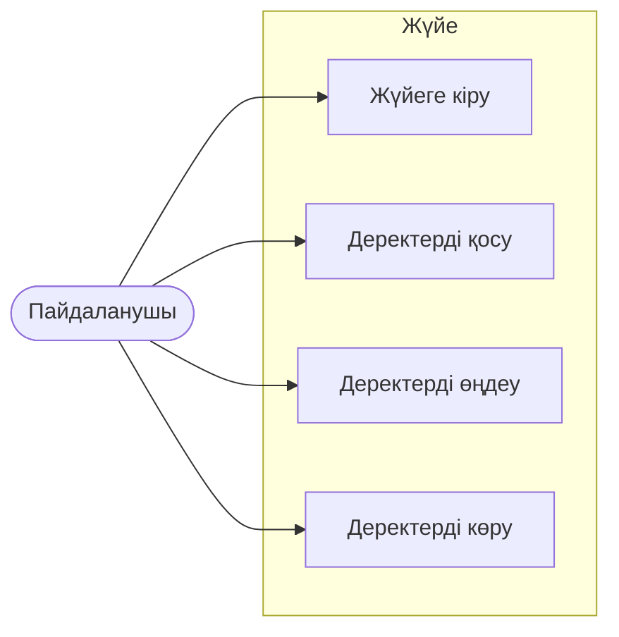
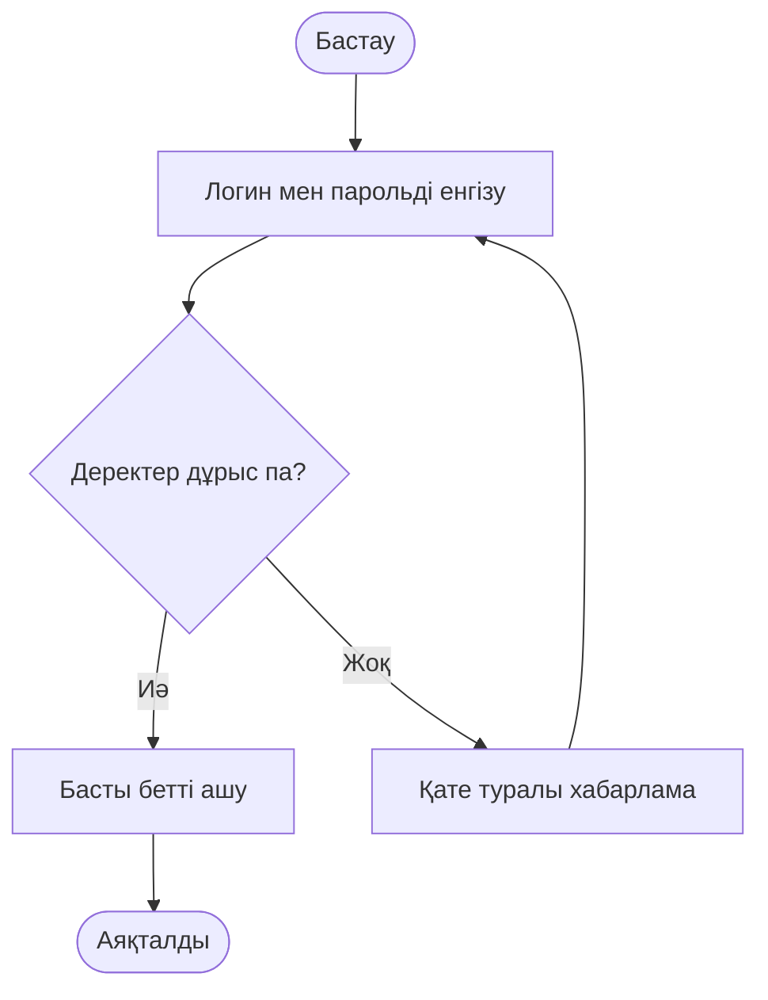

# Диаграммалар

## 1. Use-case диаграммасы

```mermaid
flowchart LR
    U(["Пайдаланушы"])
    subgraph S["Жүйе"]
        A["Жүйеге кіру"]
        B["Деректерді қосу"]
        C["Деректерді өңдеу"]
        D["Деректерді көру"]
    end
    U --> A
    U --> B
    U --> C
    U --> D
```

## 2. Жүйеге кіру процесі

```mermaid
flowchart TD
    Start(["Бастау"]) --> Input["Логин мен парольді енгізу"]
    Input --> Check{"Деректер дұрыс па?"}
    Check -- "Иә" --> Home["Басты бетті ашу"]
    Check -- "Жоқ" --> Error["Қате туралы хабарлама"]
    Error --> Input
    Home --> End(["Аяқталды"])
```
